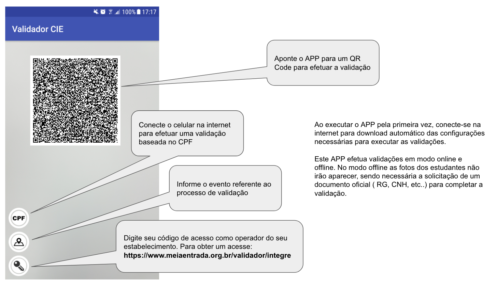

# Validador CIE

App Android para validação de carteiras de identificação de estudantes digitais

Este APP foi criado para servir de referência para estabelecimentos interessados em validar carteiras de identificação de estudantes (CIE) digitais seguindo as diretrizes do www.meiaentrada.org.br

# Ambiente de compilação utilizado
Android Studio 3.0.1
Build #AI-171.4443003, built on November 9, 2017
JRE: 1.8.0_152-release-915-b08 x86_64
JVM: OpenJDK 64-Bit Server VM by JetBrains s.r.o

Importe no Android Studio a pasta ValidadorCIE como um projeto existente, e sincronize o mesmo com os arquivos do Gradle.

Testado em Celulares Samsung Galaxy S7 e Xiaomi Redmi 2pro

# Instruções de uso

 

[Ler Aviso Legal deste Projeto](docs/DISCLAIMER.md)